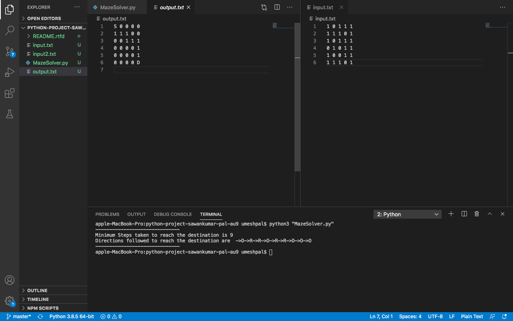
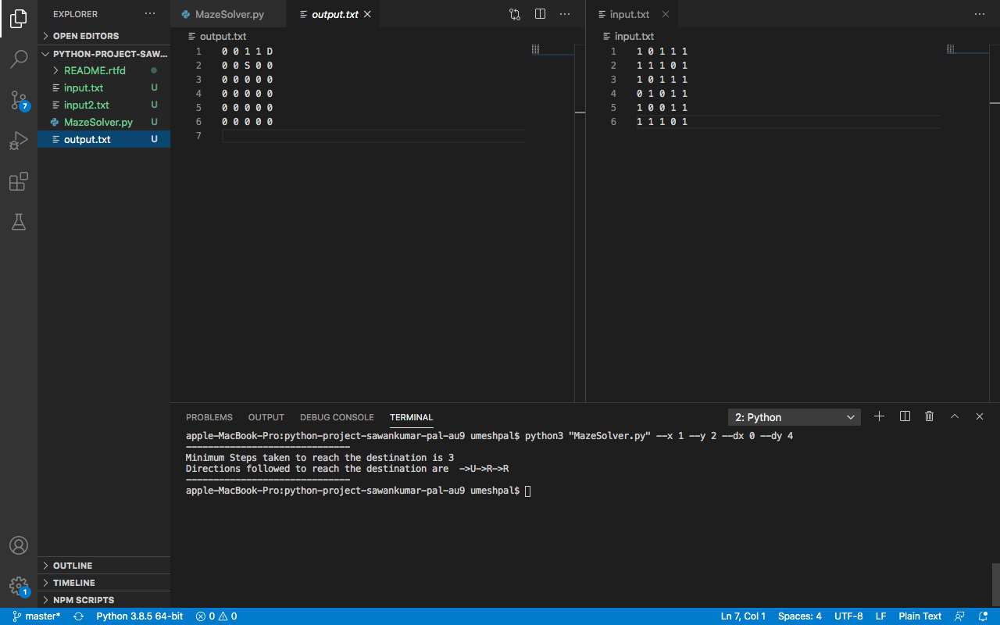
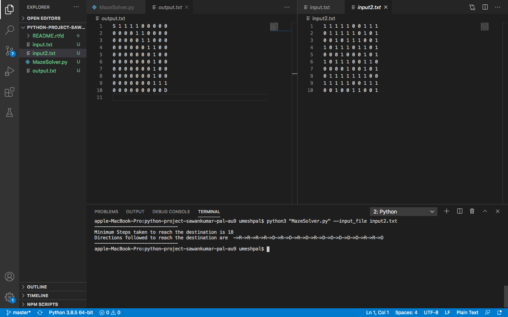
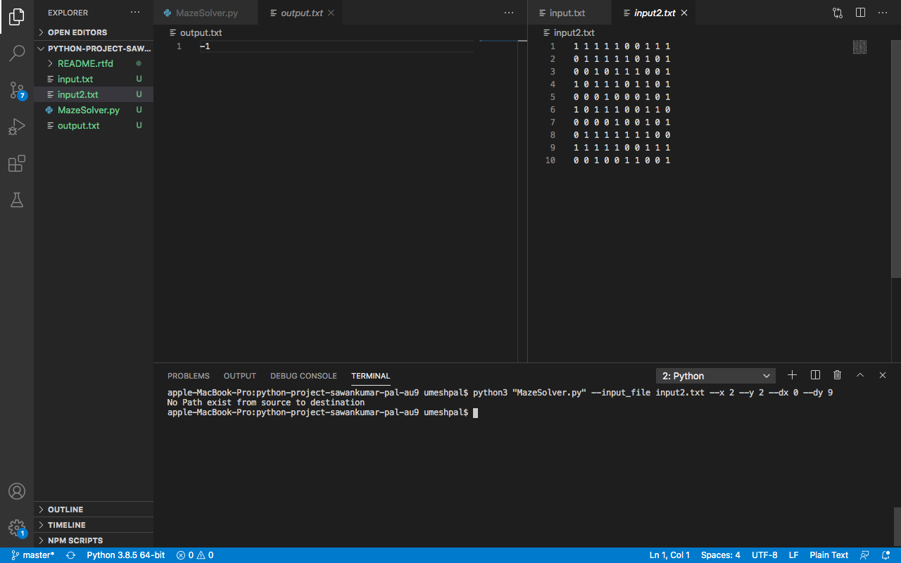
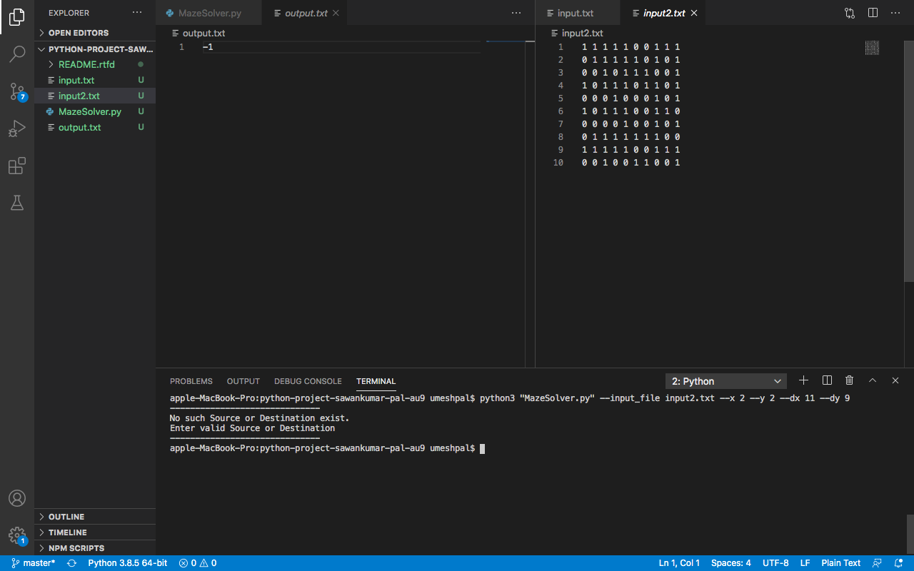

# Maze Solver Using Python

## Introduction
Hi guys! this repo is about Maze Solver application So , I have given a maze of binary matrix of order NxM on some text file where cells with 1's represents open cells where I can pass and cells with 0's represents blocked cells where through which i can't pass and i have provided with source and destination co-ordinates and I supposed to find a path from source to destination in a maze and have to the display path from source to destination if no path is possible write "-1" on another text file.

So, to accomplish this task I have build an application using python3 whose code i have pushed in my github repository 
you can check it out using this link: <https://github.com/sawankumar-pal-au9/python-project-sawankumar-pal-au9>

Make sure that you should have at-least one input text file where you should create a binary maze of size NxM and pass 
it as command line argument.
___
## Libraries & Functions Used
* argparse               (for passing arguments through command line)
* copy                   (for making a deep copy of path from source to destination)
* open(file_name,'r')    (for reading a maze inside an input file provided)
* open(file_name,'w')    (for writing path from source to destination inside an output file)
---
## Algorithm used
* Depth First Search Algorithm
* Backtracking
---
## Arguments we can pass through CLI
* --help or -h         
* --input_file (Input File Name)
* --output_file (Output File Name)
* --x (Source row number)
* --y (Source column number)
* --dx (Destination row number)
* --dy (Destination column number)
---
## References
* [Command line parsing](https://www.youtube.com/watch?v=0twL6MXCLdQ)
* [File Handling](https://www.youtube.com/watch?v=ixEeeNjjOJ0)
* [Graph Data Structure Algorithms](https://www.geeksforgeeks.org/graph-data-structure-and-algorithms/)
---
## Screenshots for reference
To show you guys an example how my code works I have created two input files input.txt and input2.txt where I defined a binary maze.
My program will take input.txt file as a default input file and treat top left cell as Source and bottom right cell as destination
and create default output.txt file and display path over there if i do not pass any argument through command line.
___
This is an output for default inputs.
As you can see my program is showing message in command terminal as well for Number of steps taken and Directions followed to reach the destination.

___
This is an output if we provide source and destination co-ordinates through command line.

___
This is an output if we pass some input file having binary maze through command line.

___
This is an output if there is no path from source to destination for a given maze.

___
This is an output if we give source or destinaton co-ordinates which do not exist in our maze.

